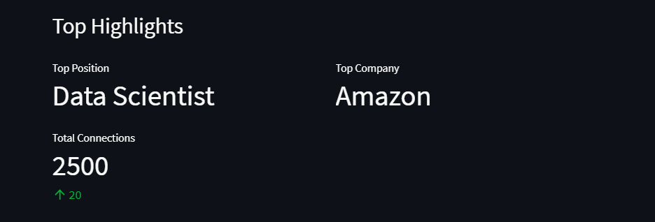
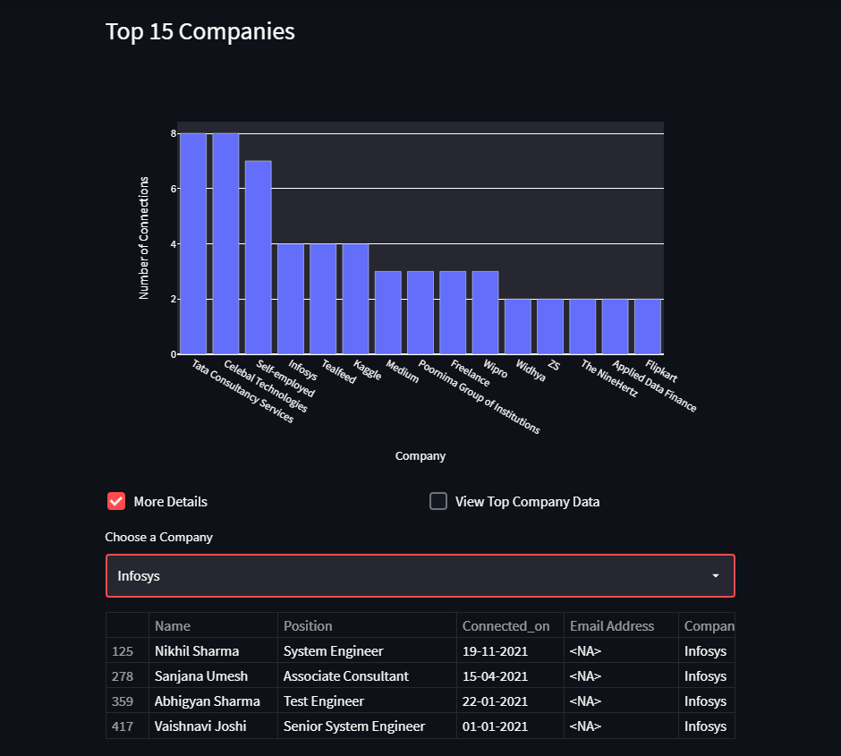
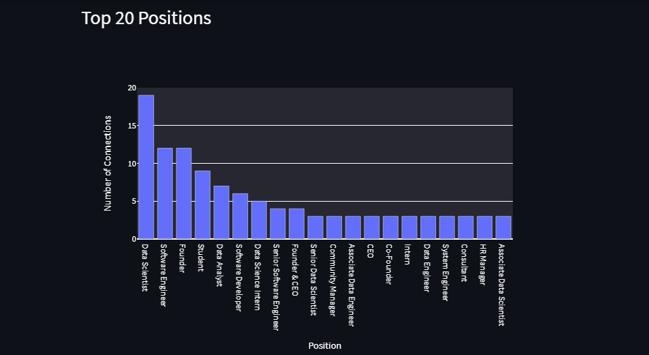
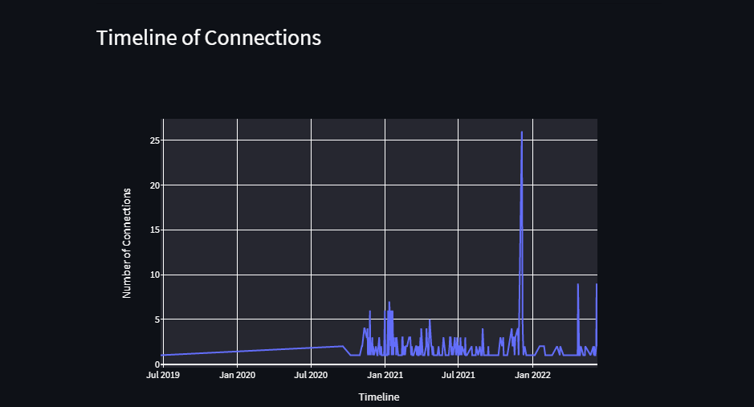
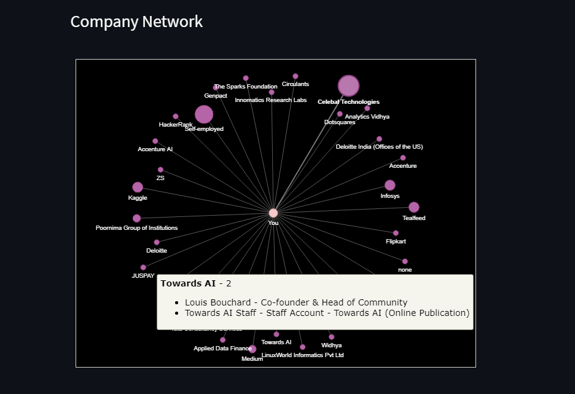
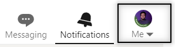
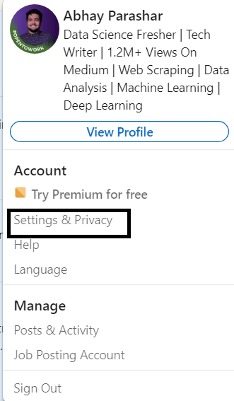
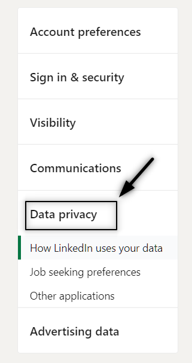
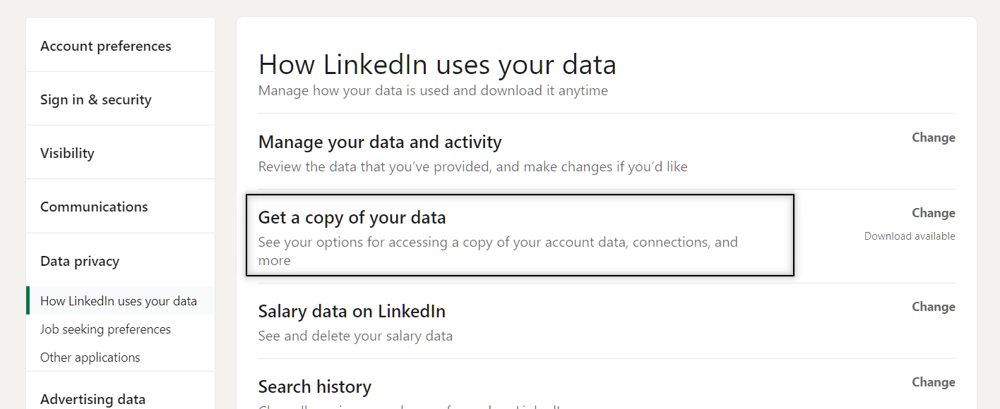
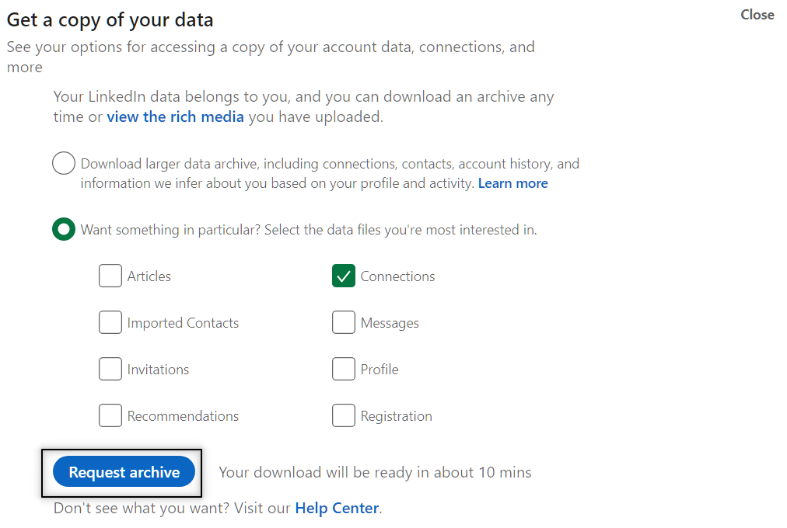

# Linkedin Connection Visualizer 🪄

 
 ### Get To Know Your Network Better Today!!
 

### Features
- Total connections on Linkedin.
- Where most of your connections work at
- What title most of your connections hold
- Person you last connected with
- Newest peoson you are connected to
- Bar charts for top companies and positions
- Bar charts for total number of connections on different months and weekdays
- Time seires plot for your connections over time
- Network graph for your connections 
- Last but note least, list of connections who shares emails with you

[Try it Now](https://share.streamlit.io/abhayparashar31/linkedin-connection-visualizer/main/app.py)

### Images

### How To Get Your Data?

Head over to your homepage and click on your profile

Click on `Setting and Privacy`

Head over to `Data Privacy` tab

Click on `Get a Copy of Your Data`

Check the Connections Checkbox and Download the Archive (You will get an email when it is avalible, generally takes 10-15 minutes)

Once you get the data in `Zip` file, head over to the [web app](https://share.streamlit.io/abhayparashar31/linkedin-connection-visualizer/main/app.py) and upload it!!!! 
Enjoy Your Amazing Insights !!!!

## Run Locally
* Clone The Project
* Install all requiments from `requirements.txt`
* `cd LinkedIn-Connection-Visualizer`
* `streamlit run app.py`

## Contributing

Contributions are always welcome!!!!

**Developed By** [@abhayparashar31](https://github.com/Abhayparashar31)
* 
References : [Benedit Neo](https://github.com/benthecoder/linkedin-visualizer)
